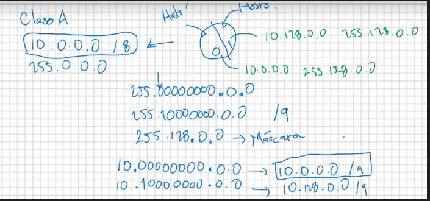

## Subneteo
El tercer componente, aparte de redes y hosts, es la `Máscara de Red`

En una Clase C:
1. ID de red
    * 10.10.10.0
2. Broadcast
    * 10.10.10.255

Si dividimos 
```
DIRECCIÓN IP
------------
MÁSCARA DE RED
```
El resultado es: `Identificador de red`


| Clase | Máscara predeterminada |
| ----- | ---------------------- |
| A     | 255.0.0.0              |
| B     | 255.255.0.0            |
| C     | 255.255.255.0          |

### Diagonal X
La `X` se refiere al numero de bits en 1 de la dirección IP.

### División Predeterminada NO variable de una red


En el ejemplo se quiso dividir la red en dos partes, por lo tanto `se cambia un bit de 0 a 1`

El resultado son dos subredes que comparten la misma máscara de red.

### Tamaño de paso
Valor que definirá la distancia numérica entre las distintas subredes a partir de los bits que se modifican.

**Si queremos dividir la red en 4 subredes:**

255.<mark>11</mark>000000.0.0

Modificamos dos bits, obteniendo como resultado

**10.192.0.0**

```
256 - 192
```
El tamaño de paso es 64

Por lo tanto, podemos dividir la subred en las siguientes IPs:

| Dirección IP | Máscara     |
| ------------ | ---------   |
| 10.0.0.0     | 255.192.0.0 |
| 10.64.0.0    | 255.192.0.0 |
| 10.128.0.0   | 255.192.0.0 |
| 10.192.0.0   | 255.192.0.0 |