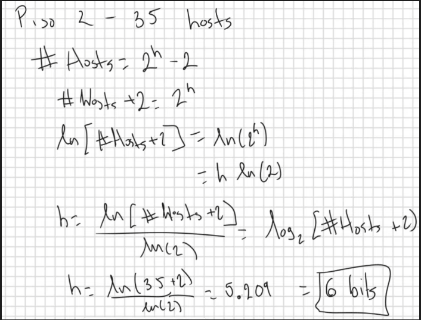
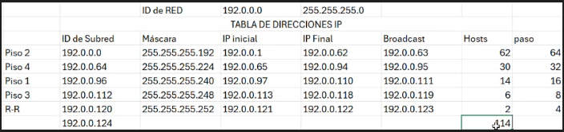

# Subneteo Variable
Más eficiente. No desperdicia Direcciones IP.

* A partir del número de hosts requerido en cada piso

Ejemplo

En el edificio queremos
* PISO 1: 12 Hosts
* PISO 2: 35 Hosts
* PISO 3: 6 hosts
* PISO 4: 20 hosts
* Subred para R-R: 2 Hosts

Cálculo para el PISO 2:

Por lo tanto, en este caso `6 bits para hosts`, es decir, `en 0`

Máscara para PISO 2:

255.255.255.11<mark>000000</mark>

Tamaño de paso: 256 - 192 = 64

Repetir para cada PISO

Resultado

